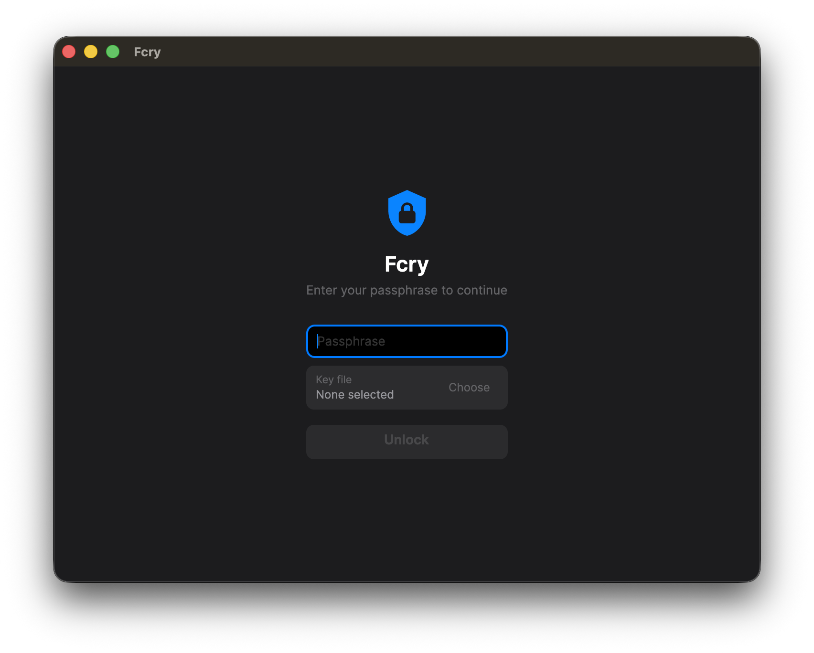
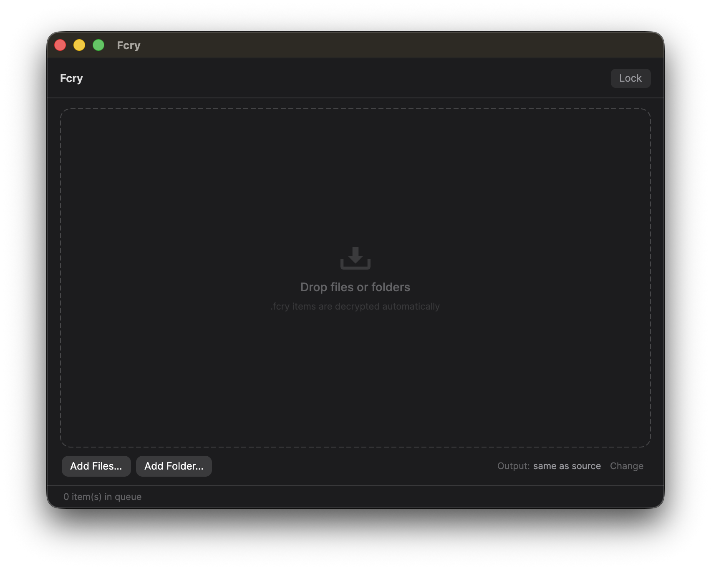

# Fcry

Fcry is a simple, cross-platform desktop app for encrypting your files and folders with a passphrase. Drop a file in, get an encrypted `.fcry` file out. Drop a `.fcry` file in, get your original back. Your passphrase never touches the disk.


## Screenshots

| Lock screen | Main screen |
|---|---|
|  |  |

## What it does

- Encrypt any file or folder with AES-256-GCM, the same encryption used by banks and password managers.
- Decrypt is automatic. Fcry recognizes its own `.fcry` files and turns them back into the original file or folder.
- Encrypt whole folders. A folder becomes a single `.fcry` file and unpacks back to the exact same folder.
- Process many items at once, with a progress bar for each.
- Lock the app at any time, and it auto-locks after 5 minutes of inactivity so your files stay protected if you step away.

## Getting the app

Fcry ships as a normal desktop app you can double-click. You build it once with the included scripts, then run it like any other program.

First install the [.NET 10 SDK](https://dotnet.microsoft.com/download/dotnet/10), then from the project folder run the script for your system:

### macOS

```bash
./build/package-macos.sh
```

This creates `build/Fcry.app`. Double-click it in Finder to run. To keep it around, drag `Fcry.app` into your Applications folder.

The first time you open it, macOS may say the app is from an unidentified developer. Right-click the app, choose Open, then click Open in the dialog. You only need to do this once.

### Windows

```bash
./build/package-windows.sh
```

This creates `build/Fcry-win-x64.zip`. Copy it to your Windows machine, unzip it, and double-click `Fcry.exe`. Windows may show a SmartScreen warning on first run. Click More info, then Run anyway.

### Linux

```bash
./build/package-linux.sh
```

This creates `build/Fcry-linux-x64.tar.gz`. Extract it on your Linux machine, then either run `./bin/Fcry` directly or run `./install.sh` to add Fcry to your application menu with its icon.

All builds are self-contained, so the person running the app does not need .NET installed.

## How to use it

### 1. Set your passphrase

When you open Fcry you see a lock screen. Type a passphrase and click Unlock. The first passphrase you ever use sets up the app. There is no separate sign-up and no account.

Important: there is no password reset. If you forget your passphrase, the files you encrypted with it cannot be recovered. Choose something you will remember, or store it in a password manager.

### 2. Encrypt or decrypt

Once unlocked, you can add items two ways:

- Drag and drop files or folders onto the window.
- Click Add Files or Add Folder to pick them with a file browser.

Fcry decides what to do automatically:

- A normal file or folder gets encrypted into a new `.fcry` file next to it.
- A `.fcry` file gets decrypted back to the original.

Each item shows its progress and result in the queue. When something finishes, click Show to reveal it in your file manager.

### 3. Choose where output goes (optional)

By default, encrypted and decrypted files are saved next to the originals. To send them somewhere else, click Change next to Output and pick a folder.

If a file with the same name already exists, Fcry never overwrites it. It saves a numbered copy instead, like `report (1).pdf`.

### 4. Lock when you are done

Click Lock in the top-right corner, or press Cmd+L on macOS or Ctrl+L on Windows and Linux. Locking wipes your passphrase from memory and returns to the lock screen. Fcry also locks itself automatically after 5 minutes of inactivity, with a countdown shown in the last minute.

## Using a key file (optional extra security)

A key file turns your passphrase into two-factor protection. On the lock screen, click Choose next to Key file and pick any file: a photo, a PDF, anything. From then on, unlocking needs both your passphrase and that exact file.

Use this if you want files that cannot be opened with the passphrase alone. Keep the key file somewhere separate from your encrypted files, like a USB stick.

Warning: if you lose the key file, files encrypted with it cannot be recovered. The key file is never changed or copied by Fcry, but do not edit it, because even a one-byte change makes it a different key.

## How your files are protected

- Your passphrase is never written to disk. Fcry turns it into a key in memory using Argon2id, a slow, memory-hard function designed to resist password cracking.
- Every file gets its own unique encryption key, derived with HKDF-SHA256. The master key from your passphrase is never used to encrypt directly.
- Encryption uses AES-256-GCM, which also detects tampering. If a `.fcry` file is corrupted or you use the wrong passphrase, Fcry tells you clearly instead of producing a broken file.
- Key material in memory is zeroed the moment it is no longer needed, and on supported systems the master key is locked into RAM so it is never written to the swap file.

The only thing Fcry stores on disk is a random salt used for key derivation. It never stores your passphrase or your key.

## File format

Encrypted files use this layout:

```
[4 bytes]  Magic: 0x46 0x43 0x52 0x59  ("FCRY")
[1 byte]   Version: 0x01
[32 bytes] Per-file salt (used in key derivation)
[12 bytes] IV (nonce)
[8 bytes]  Original name length (big-endian)
[N bytes]  Original name, or "foldername/" for an encrypted folder
[rest]     Ciphertext plus a 16-byte authentication tag
```

## Building and running from source

For development you can run the app directly without packaging:

```bash
git clone https://github.com/yourname/Fcry
cd Fcry/App
dotnet run
```

To build the whole solution:

```bash
dotnet build Fcry.sln
```

### Project layout

```
Fcry/
  Core/    Pure .NET class library with all the cryptography and file logic. No UI.
  App/     Avalonia user interface, built with the MVVM pattern.
  build/   Packaging scripts and the app icon for each platform.
```

### Cryptography settings

| Setting | Value |
|---|---|
| Key derivation | Argon2id |
| Argon2id iterations | 4 |
| Argon2id memory | 64 MB |
| Argon2id parallelism | 2 |
| Key length | 32 bytes (256-bit) |
| Per-file key | HKDF-SHA256 |
| Encryption | AES-256-GCM |

### Dependencies

| Package | Purpose |
|---|---|
| [Avalonia 11](https://avaloniaui.net) | Cross-platform user interface |
| [CommunityToolkit.Mvvm](https://github.com/CommunityToolkit/dotnet) | MVVM helpers |
| [Konscious.Security.Cryptography.Argon2](https://github.com/kmaragon/Konscious.Security.Cryptography) | Argon2id |

Everything else (AES-GCM, HKDF, SHA-256, folder archiving) uses the .NET runtime built in.

## A note on trust

Fcry is built for personal use and is not independently audited. It is not code-signed or notarized, which is why your operating system may warn you on first launch. It makes no network connections, has no telemetry, and stores nothing about you. Your passphrase and keys never leave your computer.

## License

MIT
